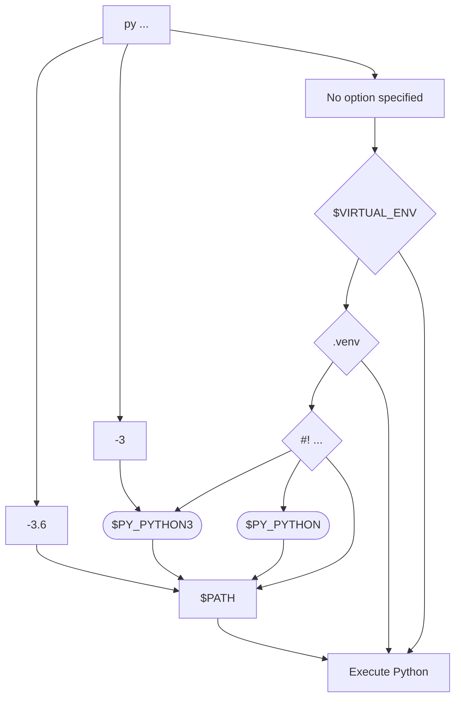

# The Python Launcher for Unix

Launch your Python interpreter the lazy/smart way!

This project is an implementation of the `py` command for Unix-based platforms
(with some potential experimentation for good measure 😉).

The goal is to have `py` become the cross-platform command that Python users
typically use to launch an interpreter while doing development. By having a
command that is version-agnostic when it comes to Python, it side-steps
the "what should the `python` command point to?" debate by clearly specifying
that upfront (i.e. the newest version of Python that can be found). This also
unifies the suggested command to document for launching Python on both Windows
as Unix as `py` has existed as the preferred
[command on Windows](https://docs.python.org/3/using/windows.html#launcher)
since 2012 with the release of Python 3.3.

Typical usage would be:

```
py -m venv .venv
py ...  # Normal `python` usage.
```

This creates a virtual environment in a `.venv` directory using the latest
version of Python installed. Subsequent uses of `py` will then use that virtual
environment as long as it is in the current (or higher) directory; no
environment activation required (although the Python Launcher supports activated
environments as well)!

A non-goal of this project is to become the way to launch the Python
interpreter _all the time_. If you know the exact interpreter you want to launch
then you should launch it directly; same goes for when you have
requirements on the type of interpreter you want (e.g. 32-bit, framework build
on macOS, etc.). The Python Launcher should be viewed as a tool of convenience,
not necessity.

## Installation
<!-- [[[cog
download_template = """1. [Download `python_launcher-{version}-{platform}.tar.xz`](https://github.com/brettcannon/python-launcher/releases/download/{tag}/python_launcher-{version}-{platform}.tar.xz):

```
curl --location --remote-name https://github.com/brettcannon/python-launcher/releases/download/{tag}/python_launcher-{version}-{platform}.tar.xz
```

2. Install into, e.g. `/usr/local`:

```
tar --extract --strip-components 1 --directory /usr/local --file python_launcher-{version}-{platform}.tar.xz
```"""

def platform_download(platform):
    instructions = download_template.format(tag=TAG, version=VERSION,
                                            platform=platform)
    print(instructions)
]]] -->
<!-- [[[end]]] -->

### Linux

#### Package managers

<details>
    <summary>Linuxbrew</summary>

```
brew install python-launcher
```

- https://formulae.brew.sh/formula/python-launcher
- https://docs.brew.sh/Homebrew-on-Linux
    
</details>

<details>
    <summary>Arch</summary>

```
yay -S python-launcher
```

- https://aur.archlinux.org/packages/python-launcher
- https://archlinux.org/
    
</details>

<details>
    <summary>Fedora</summary>

```
sudo dnf install python-launcher
```

Requires Fedora 34 or higher.

- https://src.fedoraproject.org/rpms/rust-python-launcher/
- https://getfedora.org/

</details>

#### Pre-built binaries

<details>
    <summary>RISC-V</summary>

<!-- [[[cog
platform_download("riscv64gc-unknown-linux-gnu")
]]] -->
1. [Download `python_launcher-1.0.0-riscv64gc-unknown-linux-gnu.tar.xz`](https://github.com/brettcannon/python-launcher/releases/download/v1.0.0/python_launcher-1.0.0-riscv64gc-unknown-linux-gnu.tar.xz):

```
curl --location --remote-name https://github.com/brettcannon/python-launcher/releases/download/v1.0.0/python_launcher-1.0.0-riscv64gc-unknown-linux-gnu.tar.xz
```

2. Install into, e.g. `/usr/local`:

```
tar --extract --strip-components 1 --directory /usr/local --file python_launcher-1.0.0-riscv64gc-unknown-linux-gnu.tar.xz
```
<!-- [[[end]]] -->

</details>
    
<details>
    <summary>AArch64</summary>

<!-- [[[cog
platform_download("aarch64-unknown-linux-gnu")
]]] -->
1. [Download `python_launcher-1.0.0-aarch64-unknown-linux-gnu.tar.xz`](https://github.com/brettcannon/python-launcher/releases/download/v1.0.0/python_launcher-1.0.0-aarch64-unknown-linux-gnu.tar.xz):

```
curl --location --remote-name https://github.com/brettcannon/python-launcher/releases/download/v1.0.0/python_launcher-1.0.0-aarch64-unknown-linux-gnu.tar.xz
```

2. Install into, e.g. `/usr/local`:

```
tar --extract --strip-components 1 --directory /usr/local --file python_launcher-1.0.0-aarch64-unknown-linux-gnu.tar.xz
```
<!-- [[[end]]] -->

</details>
    
<details>
    <summary>x86-64</summary>

<!-- [[[cog
platform_download("x86_64-unknown-linux-gnu")
]]] -->
1. [Download `python_launcher-1.0.0-x86_64-unknown-linux-gnu.tar.xz`](https://github.com/brettcannon/python-launcher/releases/download/v1.0.0/python_launcher-1.0.0-x86_64-unknown-linux-gnu.tar.xz):

```
curl --location --remote-name https://github.com/brettcannon/python-launcher/releases/download/v1.0.0/python_launcher-1.0.0-x86_64-unknown-linux-gnu.tar.xz
```

2. Install into, e.g. `/usr/local`:

```
tar --extract --strip-components 1 --directory /usr/local --file python_launcher-1.0.0-x86_64-unknown-linux-gnu.tar.xz
```
<!-- [[[end]]] -->
    
</details>

### macOS


#### Package managers

<details>
    <summary>Homebrew</summary>

```
brew install python-launcher
```

- https://formulae.brew.sh/formula/python-launcher
- https://brew.sh/
    
</details>


#### Pre-built binaries

<details>
    <summary>Apple Silicon</summary>

<!-- [[[cog
platform_download("aarch64-apple-darwin")
]]] -->
1. [Download `python_launcher-1.0.0-aarch64-apple-darwin.tar.xz`](https://github.com/brettcannon/python-launcher/releases/download/v1.0.0/python_launcher-1.0.0-aarch64-apple-darwin.tar.xz):

```
curl --location --remote-name https://github.com/brettcannon/python-launcher/releases/download/v1.0.0/python_launcher-1.0.0-aarch64-apple-darwin.tar.xz
```

2. Install into, e.g. `/usr/local`:

```
tar --extract --strip-components 1 --directory /usr/local --file python_launcher-1.0.0-aarch64-apple-darwin.tar.xz
```
<!-- [[[end]]] -->
    
</details>

<details>
    <summary>x86-64</summary>

<!-- [[[cog
platform_download("x86_64-apple-darwin")
]]] -->
1. [Download `python_launcher-1.0.0-x86_64-apple-darwin.tar.xz`](https://github.com/brettcannon/python-launcher/releases/download/v1.0.0/python_launcher-1.0.0-x86_64-apple-darwin.tar.xz):

```
curl --location --remote-name https://github.com/brettcannon/python-launcher/releases/download/v1.0.0/python_launcher-1.0.0-x86_64-apple-darwin.tar.xz
```

2. Install into, e.g. `/usr/local`:

```
tar --extract --strip-components 1 --directory /usr/local --file python_launcher-1.0.0-x86_64-apple-darwin.tar.xz
```
<!-- [[[end]]] -->
    
</details>

### NetBSD

#### Pre-built binaries
<details>
    <summary>x86-64</summary>

<!-- [[[cog
platform_download("x86_64-unknown-netbsd")
]]] -->
1. [Download `python_launcher-1.0.0-x86_64-unknown-netbsd.tar.xz`](https://github.com/brettcannon/python-launcher/releases/download/v1.0.0/python_launcher-1.0.0-x86_64-unknown-netbsd.tar.xz):

```
curl --location --remote-name https://github.com/brettcannon/python-launcher/releases/download/v1.0.0/python_launcher-1.0.0-x86_64-unknown-netbsd.tar.xz
```

2. Install into, e.g. `/usr/local`:

```
tar --extract --strip-components 1 --directory /usr/local --file python_launcher-1.0.0-x86_64-unknown-netbsd.tar.xz
```
<!-- [[[end]]] -->

</details>
    
### Any OS supporting Rust

<details>
    <summary>Crates.io</summary>

```

cargo install python-launcher

```

- https://crates.io/crates/python-launcher
- https://crates.io

</details>
    
    
<details>
    <summary>Source</summary>

From a [repository](https://github.com/brettcannon/python-launcher.git) checkout:
```

cargo install --path .

```

- https://github.com/brettcannon/python-launcher
- https://github.com/brettcannon/python-launcher.git

</details>

## Documentation

The general control flow for finding the appropriate Python executable is the
following (with Python 3.6, Python 3, and the newest version of Python installed
as examples):



See the
[man page](https://github.com/brettcannon/python-launcher/blob/main/docs/man-page/py.1.md)
or the top section of `py --help` for more details.

See the [API docs](https://docs.rs/python-launcher/) for using this project to
build your own custom Launcher.

## FAQ

### Why isn't the Python Launcher finding all of my Python versions installed via [Homebrew](https://brew.sh/)?

If you have multiple installs of Python via [Homebrew](https://brew.sh/) but
they are not all being found (as verified via `py --list`), chances are Homebrew
didn't symlink an installation due to the `python` symlink already being
defined. For each installation you are missing you will need to tell Homebrew to
ignore the conflict so that the version-specific `python` symlink gets created.

For instance, if your Python 3.10 installation isn't being found (due to
`python3.10` not existing), try running:

```sh
brew link --overwrite python@3.10
```

That will critically symlink the `python3.10` command. It will also overwrite
what `python3` points at, so you may want to run the `brew link` command for the
newest version of Python you have installed last.


### How do I have [Starship](https://starship.rs/) use the Python Launcher to display the Python version?

Add the following to your [Starship configuration file](https://starship.rs/config/):

```TOML
[python]
python_binary = ["py"]
# The following isn't necessary, but convenient.
detect_folders = [".venv"]
```


By using the Launcher with Starship, your prompt will tell you which Python
version will be used if you run `py`. Since the Launcher supports virtual
environments, the prompt will properly reflect both what global install of
Python will be used, but also the local virtual environment.


### How do I get a table of Python executables in [Nushell](https://www.nushell.sh/)?

```sh
py --list | lines | split column "│" version path | str trim
```

Do note that the character that is being split on is **not** the traditional
[U+007C/"Vertical Line"/pipe character](https://www.compart.com/en/unicode/U+007C) (`|`),
but [U+2502/"Box Drawings Light Vertical"](https://www.compart.com/en/unicode/U+2502) (`│`).


### How can I make the Python Launcher use my default Python version from [pyenv](https://github.com/pyenv/pyenv)?

If you're using [pyenv](https://github.com/pyenv/pyenv) to manage your Python
versions, you'll want to set the version the Launcher uses to the pyenv
[global version](https://github.com/pyenv/pyenv/blob/master/COMMANDS.md#pyenv-global).

Add this line to your `.zshrc` or `.bashrc` file:

```sh
export PY_PYTHON=$(pyenv exec python -c "import sys; print('.'.join(map(str, sys.version_info[:2])))")
```

Or this line to your `~/.config/fish/config.fish` file:

```sh
set -gx PY_PYTHON (pyenv exec python -c "import sys; print('.'.join(map(str, sys.version_info[:2])))")
```

## Appendix

- [PEP 397: Python launcher for Windows](https://www.python.org/dev/peps/pep-0397/)
- [PEP 486: Make the Python Launcher aware of virtual environments](https://www.python.org/dev/peps/pep-0486/)
- Python Launcher for Windows
  - [Documentation](https://docs.python.org/3/using/windows.html#launcher)
  - [Source](https://github.com/python/cpython/blob/master/PC/launcher.c)
