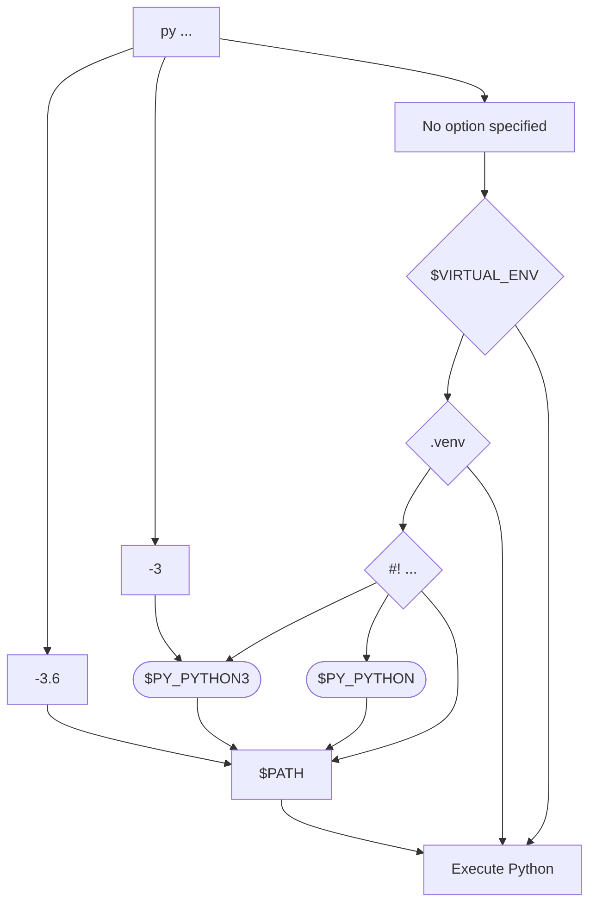

# The Python Launcher for Unix

## Why this tool exists

The goal of the Python Launcher for Unix is to figure out what Python interpreter you want when your run the `py` command. Its preference is to find the interpreter using the newest version of Python that is as specific as possible to your current context. This allows you to not have to think about or perform extra work.

## A common scenario

The Python Launcher is optimized for a workflow where you create a virtual environment for each project in its directory/workspace (although it is not restricted to this workflow). When starting a project, use the Python Launcher to create a virtual environment in a `.venv` directory:

```console
py -m venv .venv
```

This will create a virtual environment in the `.venv` directory using the newest version of Python that the Python Launcher can find. Subsequent uses of `py` will then use that virtual environment as long as it is in the current (or higher) directory.

```console
py -c "import sys; print(sys.version); print(); print(sys.executable)"
```

While this is the most common scenario, the Python Launcher is not limited to this. It can be used in other ways to select the appropriate Python interpreter for you.

## Advantages over custom solutions

Many people have taken the time to develop their own solutions for launching the appropriate Python interpreter for the situation. Typically this takes the form of some custom shell integration that does something specific/magical based on some context in the current directory. The Python Launcher, on the other hand, is meant to be a general solution that works for all situations and is not tied to any specific shell. That way, if you haven't put in the time and effort to develop your own solution to simplifying how you launch a Python interpreter, the hope is the Python Launcher can fill that need for you.

If you already have a custom workflow set up which works for you, then great! You probably don't have a direct need for the Python Launcher and should continue to use the workflow that works for you. But if you don't have a custom solution and want to simplify how you launch Python interpreters, then the Python Launcher is a good option to consider.

## Non-goals

A non-goal of this project is to become the way to launch the Python
interpreter _all the time_. If you know the exact interpreter you want to launch
then you should launch it directly; same goes for when you have
requirements on the type of interpreter you want (e.g. 32-bit, framework build
on macOS, etc.). The Python Launcher should be viewed as a tool of convenience,
not necessity.

## Selecting a Python interpreter

The Python Launcher tries to launch the correct Python interpreter for your current situation.

The Python Launcher will always prefer a Python interpreter associated with the current context over a globally installed interpreter (e.g. a virtual environment in the current directory is better than an interpreter on `PATH`). Beyond that, the Python interpreter always prefers the newest Python version available.

To accomplish all of this is a two-step process of gathering inputs in its decision-making process:

1. The Python Launcher looking at your current context to gather a list of possible interpreters.
2. You specifying any restrictions on the interpreter you want to use to filter that list down.

### Specifying interpreter requirements

The Python Launcher lets you restrict, to varying specificity, what Python version you are after. If you specify nothing then the Python Launcher will simply choose the interpreter with the newest Python version. But you can also specify a major version or a major and minor version to restrict potential Python versions.

#### On the command line

The `py` command supports a single flag that Python itself does not: a version restriction. The argument can take one of two forms:

1. Major version restriction, e.g. `-3` for Python 3.x.
2. Major and minor version restriction, e.g. `-3.6` for Python 3.6.

If no such argument is provided, the Python Launcher assumes **any** Python version is acceptable. If such an argument is provided it **must** be the first argument to `py` (i.e. before any other arguments; `py -3.11 -c "import sys; print(sys.executable)"`).

#### Environment variables

The Python Launcher also supports environment variables to specify the Python versions that are acceptable. Which environment variable is used is dependent upon what/whether a [command line argument](#on-the-command-line) was specified to restrict the Python version. If no argument is specified then the `PY_PYTHON` environment variable is used. If a major version argument is specified then that version number is appended to the environment variable name that is used, e.g. the `PY_PYTHON3` environment variable is used if `-3` was specified.

!!! note

    There is no environment variable for a major and minor version restriction. This is because the Python Launcher does not support a more specific restriction than a major and minor version.


The format of the environment variable is similar to the command line argument: a major or major and minor version to restrict what Python interpreters are considered acceptable. As an example, setting `PY_PYTHON` to `3.11` means you want a Python 3.11 interpreter. Setting `PY_PYTHON` to `3` means you want any Python 3 interpreter.

!!! tip
    If you have an in-development version of Python installed (i.e. an alpha, beta, or rc release), but you don't want the Python Launcher to select it by default, set `PY_PYTHON` to newest _stable_ version of Python you have installed. For instance, if you have Python 3.12.0a3 installed, but want to use Python 3.11.1 day-to-day, then set `PY_PYTHON` to `3.11`.

### Searching for interpreters

The Python Launcher searches for interpreters based on its current context. That involves looking locally, then globally, for Python interpreters.

#### Activated virtual environment

If you have an activated virtual environment, the `py` command will immediately use that. This is determined by the `VIRTUAL_ENV` environment variable that is set by the `activate` script of the virtual environment.

!!! note
    In general, this feature is not needed. If you create a virtual environment in the current directory in a `.venv` directory, the Python Launcher will automatically use that. This is discussed in more detail [below](#local-virtual-environment).

#### Local virtual environment

The Python Launcher will search the current directory for a `.venv` directory. If it finds one and it contains a virtual environment, it will use that Python interpreter. Otherwise it will search the parent directory, and so on, until it finds a `.venv` directory or reaches the root of the filesystem.

#### `PATH`

If no local virtual environment is found, the Python Launcher will search the `PATH` environment variable for a Python interpreter. The Python Launcher will search for the newest Python interpreter that meets the [version restriction](#specifying-interpreter-requirements). When the same Python version is available in multiple directories on `PATH`, the Python Launcher will use the first one it finds.

## Determining the selected interpreter

The easiest way to tell what Python interpreter the Python Launcher will select is to lean on the fact the `py` command passes its arguments (other than any [version restriction argument](#on-the-command-line)) on to the selected Python interpreter.

To print out the `sys.executable` attribute of the interpreter:

```console
py -c "import sys; print(sys.executable)"
```

If you simply care about the Python version, you can use `--version` flag:

```console
py --version
```

## Diagram of how the Python Launcher selects a Python interpreter

The Python Launcher follows the logic drawn out below for selecting the appropriate Python interpreter (with Python 3.6, Python 3, and the newest version of Python installed as examples):


